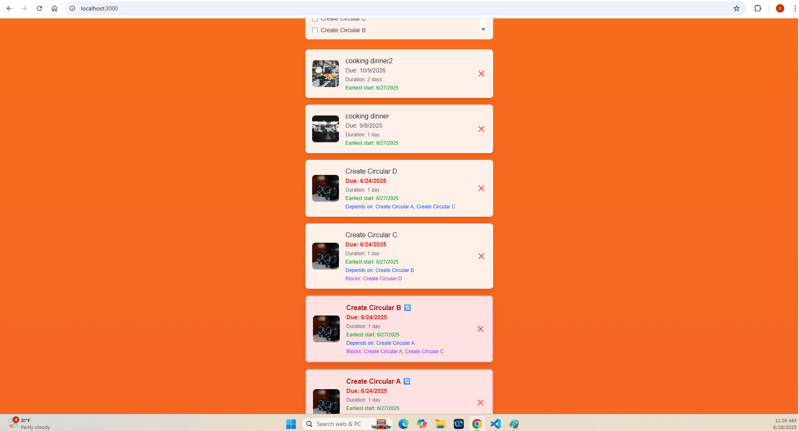

## Soma Capital Technical Assessment

This is a technical assessment as part of the interview process for Soma Capital.

> [!IMPORTANT]  
> You will need a Pexels API key to complete the technical assessment portion of the application. You can sign up for a free API key at https://www.pexels.com/api/  

To begin, clone this repository to your local machine.

## Development

This is a [NextJS](https://nextjs.org) app, with a SQLite based backend, intended to be run with the LTS version of Node.

To run the development server:

```bash
npm i
npm run dev
```

## Task:

Modify the code to add support for due dates, image previews, and task dependencies.

### Part 1: Due Dates 

When a new task is created, users should be able to set a due date.

When showing the task list is shown, it must display the due date, and if the date is past the current time, the due date should be in red.

### Part 2: Image Generation 

When a todo is created, search for and display a relevant image to visualize the task to be done. 

To do this, make a request to the [Pexels API](https://www.pexels.com/api/) using the task description as a search query. Display the returned image to the user within the appropriate todo item. While the image is being loaded, indicate a loading state.

You will need to sign up for a free Pexels API key to make the fetch request. 

### Part 3: Task Dependencies

Implement a task dependency system that allows tasks to depend on other tasks. The system must:

1. Allow tasks to have multiple dependencies
2. Prevent circular dependencies
3. Show the critical path
4. Calculate the earliest possible start date for each task based on its dependencies
5. Visualize the dependency graph

## Submission:

1. Add a new "Solution" section to this README with a description and screenshot or recording of your solution. 
2. Push your changes to a public GitHub repository.
3. Submit a link to your repository in the application form.

Thanks for your time and effort. We'll be in touch soon!

---

# Solution

## Implementation Overview

I have successfully implemented all required features, transforming the basic todo application into a comprehensive project management system with advanced scheduling capabilities.

## Features Completed

### ✅ Part 1: Due Dates
- Added date picker input for task creation
- Due dates displayed for all tasks
- **Overdue tasks highlighted in red bold text**
- Optional due dates supported

### ✅ Part 2: Image Previews  
- **Pexels API integration** for automatic image search based on task descriptions
- **Loading states** with animated spinners during task creation and image loading
- Images displayed as 64x64px previews for visual task identification
- Graceful error handling for failed image loads

### ✅ Part 3: Task Dependencies
- **Multiple dependencies**: Tasks can depend on unlimited other tasks
- **Circular dependency prevention**: Real-time detection with specific resolution suggestions
- **Critical path analysis**: Automatic identification and highlighting of longest task sequence in blue
- **Earliest start date calculation**: Project scheduling based on dependency completion times  
- **Dependency graph visualization**: Interactive modal showing complete project structure and statistics

## Advanced Features Implemented

- **Smart Conflict Resolution**: Instead of blocking circular dependencies, shows exact resolution steps ("Remove dependency from Task B to Task A")
- **Visual Task Highlighting**: Color-coded importance (🔄 red for circular issues, 🎯 blue for critical path)
- **Project Analytics**: Displays total duration, critical path tasks, and project statistics
- **Professional UX**: Loading states, form validation, and comprehensive error handling

## Screenshot




*Advanced project management todo application showing: due dates with overdue highlighting, Pexels API images, critical path analysis (blue highlighting), circular dependency warnings, task dependencies, earliest start dates, and interactive dependency graph visualization.*

## Key Algorithms

- **Critical Path Method (CPM)**: Calculates longest sequence of dependent tasks
- **Circular Dependency Detection**: Depth-first search with real-time validation
- **Project Scheduling**: Forward pass calculation for earliest start dates with dependency awareness

## Demo Instructions

1. **Test Due Dates**: Create tasks with past/future dates to see red overdue highlighting
2. **Test Images**: Create tasks like "cooking dinner" or "walk the dog" to see Pexels integration
3. **Test Dependencies**: Create Task 1 → Task 2 → Task 3 chain and observe critical path highlighting
4. **Test Circular Prevention**: Try creating circular dependencies to see intelligent warnings
5. **View Graph**: Click "📊 View Dependency Graph" to see complete project visualization

This implementation goes beyond the basic requirements to provide a production-ready project management system with intelligent conflict resolution and professional user experience.